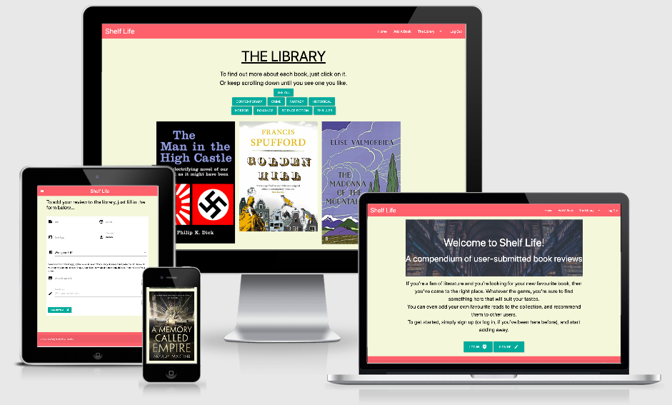

# Dominic Beesley’s 3rd Milestone Project

The aim of this project is to build a full-stack site that allows your users to manage a common dataset about a particular domain, using all the technologies that I've learned about so far from Code Institute. 

To do this, I’ve created ‘Shelf Life,’ a website for users to register, submit book reviews, and view book reviews made by other users. 

The project can be found at [http://datacentricbooks.herokuapp.com/]( http://datacentricbooks.herokuapp.com/)

## UX 

My website, ‘Shelf Life,’  is a collection of user-submitted book reviews.

The goal of the website is for users to be able to find new books to read by reading book reviews, while at the same time posting their own book reviews on the website, which may help future visitors to the site. In this aim, it’s similar to websites such as Goodreads or Shelfari.

The website is also interactive, in that users can post their own reviews, and afterwards, if any details on it need to be changed, they can edit and update them, or even delete their review and remove the book from the website completely.

Before I started making the website, I made a rough wireframe of what I hoped to achieve. The wireframe, which shows outlines of the three main pages of the website can be found [here](static/images/wireframe.pdf).

### User Stories
I have identified three main users for this site – the site owner, registered users, and non-registered (or anonymous) users.

For the site owner:
* As the site owner, I want to clearly communicate the goals of the website.
* As the site owner, I want to attract users to the website.
* As the site owner, I want to let users sign up and register to post reviews on the website.
* As the site owner, I want to let users log in, if they’ve previously signed up.
* As the site owner, I want to let users know about different books.
* As the site owner, I want to let users sort the books and view collections of different genres.
* As the site owner, I want to let users read reviews of these books, submitted by other users.
* As the site owner, I want to let users write their own reviews and add them to the site.
* As the site owner, I want to let users edit their own reviews, which they’ve already posted on the site, and update them.
* As the site owner, I want to let users delete their review from the site if they don’t want it up there any longer.
* As the site owner, I want to let users log out from the website when they’re done and want to leave.

For registered users:
* As a user, I want to be able to visit the site.
* As a user, I want to be able to sign up if it’s my first time visiting.
* As a user, I want to be able to log in after I’ve signed up.
* As a user, I want to be able to view different books.
* As a user, I want to be able to click on an individual book to view the user-submitted book review.
* As a user, I want to be able to sort books by their genres.
* As a user, I want to be able to add my own book review to the collection.
* As a user, I want to be able to view my book review after it’s been added.
* As a user, I want to be able to edit my previous book previews.
* As a user, I want to be able to update my book reviews after they’ve been edited.
* As a user, I want to be able to delete any of my book reviews that I don’t want to be on the site.
* As a user, I want to be able to log out afterwards.

For non-registered users:
* As a non-registered user, I want to be able to visit the site.
* As a non-registered user, I want to be able to view different books.
* As a non-registered user, I want to be able to click on an individual book to view the user-submitted book review.
* As a non-registered user, I want to be able to sort books by their genres.
* As a non-registered user, I want to have the option to sign up so I can add my own reviews to the site.
* As a non-registered user, I want to be able to log in after I’ve signed up.
* As a non-registered user, I want to have the option to log out afterwards.

## Features 

### Existing Features
* Dropdown – The dropdown, from [Materialize](https://materializecss.com/dropdown), adds a dropdown list. I used this in the navbar, to add a list to ‘The Library.’ When the user clicks on it, they’ll see a list of all the different genres available.

* Collection – To display each individual book review that the users have submitted to the website, I used the collections feature from [Materialize](https://materializecss.com/collections). All the information about the book – such as title, author, genre, and so on - is dynamically filled in to the collection, and the avatar is a small image of the book cover.

* Select – Select, from [Materialize](https://materializecss.com/select), allows the user to select an option from a list of specified options. I used this in the form on the ‘Add A Book’ page, for users to select a genre.

* Sidenav –  The sidenav, from [Materialize](https://materializecss.com/sidenav), is a slide out menu that shows on smaller screens. I used this to show the options on the navbar, when viewing the website on phone screens.

* Datepicker -  The datepicker from [Materialize](https://materializecss.com/pickers) is a picker that allows users to pick a date from a calendar. I used this in the form on the ‘Add A Book’ page, for users to select the date they’d read the book.

## Technologies Used 

### Programming Languages
* [HTML](https://www.w3schools.com/html/default.asp) – for creating the structure and layout of the website.
* [CSS](https://www.w3.org/Style/CSS/) – for styling the website’s content.
* [Javascript](https://www.javascript.com/) – for making some of the Materialize features work correctly.
* [jQuery](https://jquery.com/) – for initialising some of the Materialize features, such as the dropdown and datepicker, and ensuring that they work correctly for the user.
* [Markdown](https://www.markdownguide.org/) – for styling the content of this README.md.

### Websites
* [Materialize](https://materializecss.com/) – for styling the website’s and adding a framework.
* [Mongo DB Atlas](https://www.mongodb.com/cloud/atlas) – to manage the document database.
* [Heroku](http://heroku.com/) – to build, run, and operate my application.
* [Am I Responsive?](http://ami.responsivedesign.is/#) - to test responsiveness of the site.
* [W3C Markup Validation service](https://validator.w3.org/) - to check the HTML.
* [W3C CSS Validation Service](https://jigsaw.w3.org/css-validator/) - to check the CSS.
* [Pexels](http://www.pexels.com) – used to find an image of a library that could be used in the website’s header.

### Tools
* [Balsamiq](https://balsamiq.com/) – used to create a rough wireframe of the website, so I could visualise it before I started building it.

## Testing 

## Screen Sizes and Devices
* I tested the website on multiple browsers and screen sizes.
* I tested the website on both Google Chrome and Safari.
* I also tested the website, on both my laptop (a MacBook Air) and my phone (an iPhone 8).
* This helped me to ensure that the site worked as it was meant to, and check that all the and the content displayed correctly for the user. I was also able to see if the website’s content was responsive on different screen sizes, and that different pages loaded as they were meant to.

## Getting Others to Test it
* I got several friends and members of my family to test the website by signing up, logging in, and adding book reviews to the website, to ensure that everything worked as it was meant to. 
* I also got them to check if everything made sense and didn’t need any further explanations from me. 
* This helped me to fix errors such as pages linking to the wrong pages, or links that led nowhere.
* Using some of their feedback, I was also able to add explanations for the user to the website, where some parts weren’t as intuitive as I’d originally hoped they were.

## Using Online Tools and Websites
* Using [Am I Responsive?](http://ami.responsivedesign.is/#), I was able to view the website on different screen sizes and compare them at the same time.
* I validated the HTML code using the [W3C Markup Validation service](https://validator.w3.org/), and no errors were found.
* I validated the CSS code using the [W3C CSS Validation Service](https://jigsaw.w3.org/css-validator/), and no errors were found.

## Deployment 

### Introduction
* This website was deployed using Heroku.
* The code for the site was written using Gitpod.

### Creating the app on Heroku
* To deploy it on Heroku, I first signed into Heroku, using the username and password, which I’d chosen when I first registered with Heroku.
* Once signed into Heroku, I went to the Heroku dashboard.
* I clicked on ‘New.’
* I then clicked in ‘Create new app.’ 
* This took me to a page where I named the app – I chose the name ‘datacentricbooks.’
* I was also able to choose a region – for this, I chose Europe.
* I then clicked on ‘Create app,’ which took me to the app’s dashboard, as it was now created.

### Pushing to Heroku
* On my Gitpod workspace, I logged into Heroku using the CLI, with the email and password that I’d previously used to sign in to Heroku.
* Before I pushed the code from Gitpod to the Heroku server, I created two files – requirements.txt (which contained a list of the dependencies my site was using) and a Procfile.
* Once those were created, I was able to push the code to Heroku using the commands ‘git add,’ ‘git commit,’ and then ‘git push heroku master.’

### Deploying the website
* On Heroku, I went to the ‘Config vars’ section and added two variables.
* First, I set IP as 0.0.0.0.
* I then set PORT as 5000.
* Then, at the top of the Heroku dashboard, I clicked on ‘More,’ and then ‘Restart all dynos.’
* I was then able to access the site using the address [http://datacentricbooks.herokuapp.com/]( http://datacentricbooks.herokuapp.com/).

## Credits 

### Content
* I used [W3C Markup Validation service](https://validator.w3.org/) to validate the HTML code.
* I used [W3C CSS Validation Service](https://jigsaw.w3.org/css-validator/) to validate the CSS code.

### Media
The image of a library, which I used in the header of the website, is from [here]( https://www.pexels.com/photo/ancient-antique-architectural-design-architecture-442420/).

### Social Media
The links to the Visit Dubai social media pages in the footer are the home pages of [Facebook]( https://www.facebook.com), [Twitter]( https://twitter.com), and [Instagram]( https://www.instagram.com).

### Acknowledgements
I received inspiration and guidance for this project from my mentor, Oluwaseun Owonikoko.